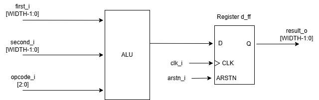

# Документация

## 1. Функциональное описание
Модуль **alu_register** представляет собой арифметико-логическое устройство с регистром для сохранения результата. 
Модуль принимает два операнда `first_i`, `second_i` и поддерживает 8 операций для них в зависимости от значения `opcode_i`
| opcode_i | операция над first_i и second_i|
| :--- | :--- |
| 3'b000 | Побитовое NOR |
| 3'b001 | Побитовое AND |
| 3'b010 | Сложение знаковое |
| 3'b011 | Сложение беззнаковое |
| 3'b100 | Побитовое NOT для `second_i` | 
| 3'b101 | Побитовое NOT-XOR для `second_i` |
| 3'b110 | Проверка равенства операндов |
| 3'b111 | Логический сдвиг `first_i` вправо на `second_i` |

Модуль оснащен асинхронным сбросом по отрицательному фронту, который обнуляет выходной регистр.

## 2. Структурная схема

## 3. Параметры
| Название | Тип | Значение по умолчанию | Описание |
| :--- | :--- | :--- | :--- |
| **WIDTH** | integer | 8 | Разрядность шин операндов и результата. |

## 4. Порты
| Название | Ширина | Направление | Описание |
| :--- | :--- | :--- | :--- |
| **clk_i** | 1 | Input | Тактовый сигнал |
| **arstn_i** | 1 | Input | Сигнал сброса |
| **first_i** | WIDTH | Input | Шина первого операнда. |
| **second_i** | WIDTH | Input | Шина второго операнда. |
| **opcode_i** | 3 | Input | Шина, кодирующая операцию |
| **result_o** | WIDTH | Output | Шина результата операции |

## 5. Тактирование и сброс
* **Тактирование:** Модуль тактируется сигналом `clk_i` по положительному фронту.
* **Сброс:** Реализован асинхронный сброс по отрицательному фронту сигнала `arstn_i`. При подаче сигнала сброса регистр `d_ff` модуля сбрасывается на значение сброса 0, независимо от тактового сигнала.

## 6. Тестирование
Для тестирования модуля реализован сценарий в файле `testbench.v`. Сценарий включает следующие шаги:

* **Асинхронный сброс:** При подаче `arstn_i = 0` выход `result_o` должен принудительно обнулиться.
* **Операция NOR (3'b000):** Проверка побитового ИЛИ-НЕ для операндов `0xAA` и `0xCC`.
* **Операция AND (3'b001):** Проверка побитового И для тех же входных данных.
* **Signed Addition (3'b010):** Проверка знакового сложения `0xFE` и `0x01`.
* **Unsigned Addition (3'b011):** Проверка беззнакового сложения тех же операндов.
* **NOT second (3'b100):** Проверка инверсии только второго операнда `0xCC`.
* **XNOR (3'b101):** Проверка побитового NOT-XOR для `0xAA` и `0xCC`.
* **Equality - Equal (3'b110):** Проверка сравнения двух одинаковых чисел `0xAA` и `0xAA`.
* **Equality - Not Equal (3'b110):** Проверка сравнения разных чисел `0xAA` и `0xCC`.
* **Shift Right (3'b111):** Проверка логического сдвига первого операнда `0xAA` вправо на величину второго операнда `0x02`.

Для всех операций контроль корректности осуществляется через анализ временных диаграмм. Значения операндов и `opcode_i` меняется с задержкой в четверть периода тактового сигнала (`#0.5`) после положительного фронта `clk_i`.
